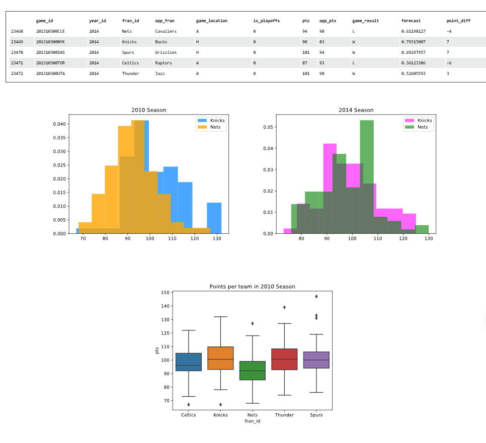
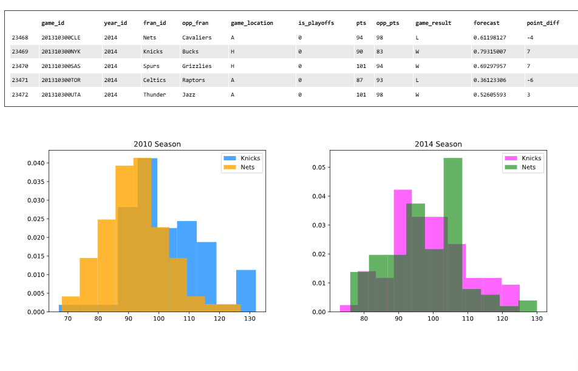
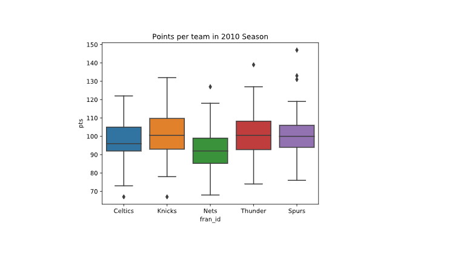
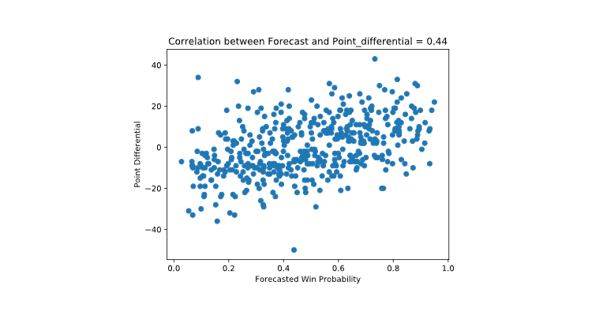
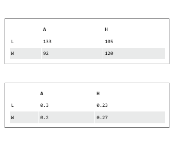

# NBA Trends Analysis

## Project Overview
This project analyzes NBA (National Basketball Association) game data to explore statistical relationships and trends between teams and across different seasons. The analysis focuses on the 2010 and 2014 seasons, examining team performance metrics, home court advantage effects, and the accuracy of win probability forecasts.



## Dataset Description
The dataset was originally sourced from FiveThirtyEight's "Complete History Of The NBA" analysis, containing historical basketball data from Basketball Reference with additional analytical variables added by FiveThirtyEight. For this project, the dataset was focused on 5 teams and includes key performance metrics such as:

- Team identifiers (`fran_id`)
- Season year (`year_id`)
- Points scored (`pts`)
- Opponent points (`opp_pts`)
- Game location (`game_location`)
- Game result (`game_result`)
- Win probability forecast (`forecast`)
- Point differential (`point_diff` - calculated as the difference between `pts` and `opp_pts`)

## Key Analyses

### 1. Team Performance Comparison
Compared scoring distributions between specific teams (e.g., Knicks vs. Nets) across different seasons using normalized histograms to visualize changes in offensive performance.



### 2. Season-wide Team Performance
Created boxplots to analyze the distribution of points scored by each team in the 2010 season, highlighting scoring consistency and outlier performances.



### 3. Home Court Advantage Analysis
Investigated the relationship between game location and results using contingency tables and chi-square analysis to determine if playing at home provides a statistically significant advantage.

### 4. Forecast Accuracy Evaluation
Assessed the reliability of win probability forecasts by:
- Calculating covariance between forecasts and actual point differentials
- Computing Pearson correlation coefficient to quantify the relationship strength
- Visualizing the correlation with scatter plots



## Key Findings

1. The scoring distributions between teams like the Knicks and Nets showed a normal distribution pattern, with a mean
for both teams around *100 and 110*. <br /><br />
Statistical analysis of game location versus results revealed some interesting pattern between the two years.\
In 2010, the difference between the Knicks and Nets is more noticeable. The average points per game for each team are 
further apart, and the histograms show less overlap. The difference in means between both team = **~9.73** in favour of
Knicks.<br /><br />
In 2014, the histograms for the Knicks and Nets are closer together, and their average points per game are more similar.
<br />
This suggests that the teams had more distinct scoring patterns in 2010 compared to 2014, suggesting an improvement in
the game on the Nets team 
2. The correlation between forecasted win probability and actual point differential was approximately **0.44**, indicating a _positive linear relationship_.
3. In terms, of an association between all teams in 2010, winning or losing at home than away, the contingency table shows the number of wins and losses for all teams in 2010, separated by game location (home or away):

   

- Teams won more games at home (120) than away (92).
- Teams lost more games away (133) than at home (105).
- This pattern suggests that playing at home gives teams an advantage, as they are more likely to win at home than on 
the other road.


## Technical Implementation

The analysis was implemented using Python with the following libraries:
- `pandas` and `numpy` for data manipulation
- `scipy.stats` for statistical tests (Pearson correlation, chi-square)
- `matplotlib` and `seaborn` for data visualization

## How to Run This Project

1. Ensure you have Python 3.x installed
2. Set up a virtual environment (see instructions below)
3. Install required dependencies from `requirements.txt`
4. Run the Jupyter notebook or Python script

### Setting Up the Virtual Environment

```bash
# Navigate to the project directory
cd path/to/NBA_Trends

# Create a virtual environment
python -m venv venv

# Activate the virtual environment
# On Windows:
venv\Scripts\activate
# On macOS/Linux:
source venv/bin/activate

# Install dependencies
pip install -r requirements.txt
```

## Future Work

Potential extensions to this analysis include:
- Expanding the dataset to include additional seasons for trend analysis
- Incorporating player-level statistics to identify key contributors
- Applying machine learning models to predict game outcomes based on historical data

## References

- FiveThirtyEight's NBA Analysis: [https://fivethirtyeight.com/features/how-we-calculate-nba-elo-ratings/](https://fivethirtyeight.com/features/how-we-calculate-nba-elo-ratings/)
- Basketball Reference: [https://www.basketball-reference.com/](https://www.basketball-reference.com/)